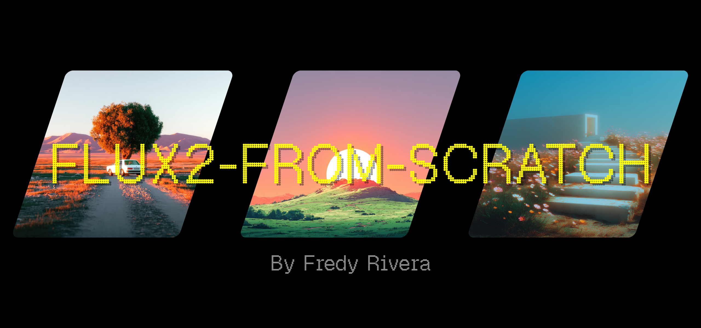

# Flux2-from-scratch

This repository implements the Flux2 model from scratch, specifically focusing on training the Flux2 Transformer. To simplify the process, I'm leveraging the existing AutoEncoder and Text Encoder.

The base implementation is taken from the official [black-forest-labs/flux2](https://github.com/black-forest-labs/flux2) repository.

> **Note:** I'll explain the entire implementation in detail on my [blog](https://fredy-rivera-dev-portafolio.vercel.app/blog) once the project is complete.